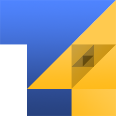

**T4** is a hierarchical spatial indexing system for spheres, built on a recursively subdivided [tetrahedron](https://en.wikipedia.org/wiki/Tetrahedron) projected onto the sphere's surface. Every point on the sphere resolves to a compact `BigInt` ID that encodes its face, its subdivision path, and its zoom level — no lookup tables, no floating-point drift, just bit-packed geometry.

It converts freely between GPS coordinates, geocentric Cartesian vectors, and T4 IDs, and lets you walk the resulting grid via parents, children, and edge-sharing neighbors. **T4's hierarchy is strictly geometric**: every parent cell is partitioned into four child cells, giving strict 1→4 containment in the flat tetrahedron domain and near-exact containment on the sphere (where child edges are geodesic arcs between warped vertices).

Whether you're building planetary datasets, game-world spatial partitioning, or a discrete global grid for geospatial queries, T4 gives you a compact, deterministic address for any point on any sphere.

[](https://www.npmjs.com/package/@fimbul-works/t4)
[](https://github.com/microsoft/TypeScript)
[](https://bundlephobia.com/package/@fimbul-works/t4)

## Table of Contents

- [Features](#features)
- [Installation](#installation)
- [Quick Start](#quick-start)
- [Why T4?](#why-t4)
- [Performance Benchmarks (vs. Uber H3)](#performance-benchmarks-vs-uber-h3)
- [When to Use T4?](#when-to-use-t4)
- [Core Concepts](#core-concepts)
- [Documentation](#documentation)
- [Example: Geocoding a Point](#example-geocoding-a-point)
- [Advanced Usage](#advanced-usage)
- [License](#license)

## Features

- 🌐 Hierarchical spatial indexing on any sphere, not just Earth
- 🧊 Compact `BigInt` IDs — face, subdivision path, and zoom packed into a single integer
- 🔁 Bidirectional conversion between GPS, geocentric Cartesian, and T4 IDs
- 🌳 Constant-time parent, children, and neighbor lookups via bit arithmetic
- 🌍 Optional WGS84 Earth curvature correction, toggleable per call
- ♻️ Memoized `T4Cell` instances via WeakRef, avoiding re-allocations on repeat lookups
- 📦 Minimal footprint, built using `@fimbul-works/vec`

## Installation

```bash
npm install @fimbul-works/t4
# or
yarn add @fimbul-works/t4
# or
pnpm install @fimbul-works/t4
```

## Quick Start

```typescript
import { latLngToT4, getT4Vertices, getT4Center, createT4 } from '@fimbul-works/t4';

// Convert a GPS coordinate to a T4 cell at zoom level 12
const id = latLngToT4(60.1699, 24.9384, 12); // Helsinki: (lat, lng)

// Get the cell's GPS vertices and center as [lng, lat] GeoJSON pairs
console.log(getT4Vertices(id)); // [[lng, lat], [lng, lat], [lng, lat]]
console.log(getT4Center(id));   // [lng, lat]

// Or work with the OOP wrapper for convenient traversal
const cell = createT4(id);
console.log(cell.zoom);      // 12
console.log(cell.parent?.id); // parent cell's BigInt ID
console.log(cell.neighbors); // [T4Cell, T4Cell, T4Cell]
console.log(cell.children);  // [T4Cell, T4Cell, T4Cell, T4Cell]
```

## Why T4?

T4 uses a different geometric model from hexagonal and cube-based global grids: a regular tetrahedron is recursively quadrisected after projection onto a sphere, producing a triangular hierarchy with strict 1→4 containment in the flat domain and near-exact containment on the sphere.

### Geometric Model

- **Strict 1→4 hierarchy** - Every parent triangle is exactly partitioned into four child triangles in the planar tetrahedral domain. On the spherical surface, containment is near-exact as child boundaries follow geodesic arcs between warped vertices, making multi-resolution aggregation and spatial hierarchy straightforward.
- **Sphere-agnostic geometry** - T4 can operate on a perfect sphere or apply WGS84 Earth curvature correction. The same indexing system can therefore represent Earth, other planetary bodies, or arbitrary spherical game worlds.
- **Triangular topology** - Every cell has exactly three edge-sharing neighbors, and the entire hierarchy derives from the topology of four tetrahedral base faces.

### Compact Addressing

- **Simplicity** - A regular tetrahedron has just 4 faces and quadrisects cleanly, so every cell is a triangle and every subdivision is one of exactly 4 cases.
- **Compact addressing** - An entire cell's lineage (face, path, zoom) lives in one `BigInt`, cheap to store, compare, and sort.
- **Predictable traversal** - Parent, child, descendant, and neighbor relationships can be resolved directly from the encoded topology rather than requiring spatial lookup tables.

## Performance Benchmarks (vs. Uber H3)

T4 is designed around compact bit-packed IDs and direct topological operations. The benchmark below compares the TypeScript implementation of T4 against Uber's `h3-js` v4.5.0 using Node.js across all **7,391 diverse locations** in `t4_corpus.json` (7,342 real-world cities + 49 edge cases / singularities; 110,865 total executions per test).

The benchmark covers hierarchical operations, spatial conversion, geometry, and topology rather than a single synthetic operation. Results are machine-dependent, so the included benchmark suite can be run locally with `pnpm benchmark:h3` or `pnpm benchmark`.

| Operation | **T4** Avg Time | **T4** Ops/sec | **Uber H3** Avg Time | **Uber H3** Ops/sec | **T4 vs H3 Speedup** |
| :--- | :--- | :--- | :--- | :--- | :--- |
| **`ID -> Children`** | **0.1271 µs** | **7,870,163** | 1.5318 µs | 652,806 | **12.06x FASTER** 🚀 |
| **`isValid`** | **0.0372 µs** | **26,866,880** | 0.1444 µs | 6,927,118 | **3.88x FASTER** 🚀 |
| **`ID -> Parent`** | **0.0833 µs** | **12,001,033** | 0.2829 µs | 3,535,008 | **3.4x FASTER** 🚀 |
| **`latLng -> ID (raw)`** | **0.3660 µs** | **2,732,118** | 0.8435 µs | 1,185,573 | **2.30x FASTER** 🚀 |
| **`Cell Area`** | **0.8501 µs** | **1,176,363** | 1.4984 µs | 667,390 | **1.77x FASTER** 🚀 |
| **`ID -> Boundary`** | **0.7487 µs** | **1,335,586** | 1.2223 µs | 818,142 | **1.63x FASTER** 🚀 |
| **`ID -> Neighbors`** | **1.2438 µs** | **803,980** | 1.3480 µs | 741,856 | **1.08x FASTER** 🚀 |
| **`ID -> Centroid`** | **0.6314 µs** | **1,583,810** | 0.4476 µs | 2,234,225 | 0.73x |
| **`latLng -> ID (warped)`** | **1.3803 µs** | **724,465** | 0.8410 µs | 1,189,036 | 0.61x *(5-step Newton unwarp)* |

Overall, T4's direct bit-packed topology gives it a substantial throughput advantage for most indexing and hierarchy operations in this benchmark, while retaining strict flat-domain 1→4 geometric containment (near-exact on the sphere) and configurable spherical/ellipsoidal coordinate handling. The full WGS84 warped conversion is intentionally more computationally expensive due to its numerical inverse transform.

## When to Use T4?

Spatial indexing systems involve fundamental geometric trade-offs. T4 was designed to solve key architectural and computational limitations found in hexagon- (H3) and cube-based (S2) grids:

### 1. 3D Game Engines & Procedural Planets (Godot, Unreal, WebGL)
- **Direct GPU Triangle Meshes**: GPUs rasterize triangles natively. A T4 cell is directly an indexed triangular mesh (`[v0, v1, v2]`), requiring zero polygon triangulation before uploading to vertex buffers (VBOs).
- **Dual Marching Tetrahedra (DMT) & Volumetric Chunks**: Slicing T4 triangular prisms along radial altitude layers creates simplicial tetrahedral meshes with **zero topological ambiguity** (eliminating Marching Cubes hole/crack bugs) and clean adaptive Level-of-Detail (LOD).
- **No 12 Degenerate Pentagons**: Unlike icosahedral systems (H3) that have 12 pentagonal singularities requiring special-case stitching, T4 has 4 completely homogeneous base faces.

### 2. Strict Hierarchies & Multi-Resolution Aggregation

- **Strict flat 1→4 containment (near-exact on sphere)** - Every T4 parent is partitioned into exactly four child triangles. Containment is exact in the flat domain and near-exact on the sphere, making the hierarchy geometrically explicit rather than an ad-hoc approximation between resolutions.
- **O(1) ancestry queries** - Checking whether cell B is a descendant of cell A is a mask comparison against the packed subdivision path.
- **Deterministic hierarchy** - A cell's complete lineage is encoded directly in its ID, allowing parent and child relationships to be derived without external hierarchy tables.

### 3. Centimeter-Scale Resolution in a Single 64-bit Integer

- **28 zoom levels** - Zoom 28 reaches approximately ~3.88 cm (flat chord) / ~4.53 cm (geodesic arc) cell edge length on Earth (`R = 6371.0` km), while the complete cell address remains encoded in a single 64-bit `BigInt`.
- **Predictable scaling** - Each additional zoom level quadrisects the cells, providing four times as many cells per level and roughly halving characteristic cell dimensions.

### 4. Non-Earth Planetary Bodies & Custom Spheres
- T4 allows configuring the sphere radius and toggling ellipsoidal flattening (`applyEarthCurvature: false`), enabling seamless indexing of moons, asteroids, exoplanets, or synthetic game worlds.

---

### When to Consider Hexagons (H3) Instead?
- **Radial Smoothing & Spatial Convolution**: Hexagons have equidistant centers to all 6 neighbors. If your primary use case is kernel density estimation, equal-distance spatial buffering, or isotropic diffusion analysis, hexagonal grids are mathematically advantageous.

## Core Concepts

### The Base Tetrahedron

T4 starts from a regular tetrahedron inscribed in the unit sphere, giving 4 base faces (0–3). Every T4 cell traces back to one of these faces.

### Subdivision

Each face recursively quadrisects into 4 child triangles per zoom level: 3 "corner" triangles (indices 0–2) and 1 "center" triangle (index 3), formed from the edge midpoints. A cell's full address is its base face plus a sequence of 2-bit subdivision indices, one per zoom level, packed directly into the ID.

### T4 IDs

A T4 ID is a single 64-bit `BigInt` packing:
- **Bits 63..62**: Base face (0–3)
- **Bits 61..6**: Fixed-position subdivision indices (2 bits per zoom level; subdivision 0 at bits 61..60 (shift 60) down to subdivision 27 at bits 7..6 (shift 6))
- **Bit 5**: Validity flag (always 1 for valid IDs)
- **Bits 4..0**: Zoom level (0–28)

This fixed-position layout enables $O(1)$ constant-time ancestor checks (`isT4Descendant`), mask-based parent and child generation, and exact discrete coordinate indexing without bit-shifting the path.

### Coordinate Conventions

- **Scalar `(lat, lng)` arguments**: Functions taking separate scalar coordinate arguments — like `latLngToT4(lat, lng, zoom)` — take latitude first, matching GIS/mapping APIs (H3, Google Maps, Leaflet).
- **Vector `[lng, lat]` arrays**: 2D coordinate arrays returned by `getT4Center`, `getT4Vertices`, `cell.center`, and accepted by `lngLatToT4([lng, lat], zoom)` or `geodeticToGeocentric([lng, lat])` follow the standard GeoJSON / Cartesian `[x=longitude, y=latitude]` convention.

### Zoom Levels & Hierarchy

T4 provides **29 discrete resolution levels** (Zoom 0 to Zoom 28):
- **Zoom 0 (Base Faces)**: Represents the 4 un-subdivided tetrahedral base faces covering the entire globe (0 subdivisions, path `[baseFace]`, length 1).
- **Zoom 1 to 28 (Subdivisions)**: Each successive zoom level $z$ adds one 2-bit quadrisect subdivision step ($0 \dots 3$). A cell at zoom $z$ contains exactly $z$ subdivisions (path `[baseFace, s0, ... s_{z-1}]`, length $z + 1$).
- **Resolution Scaling**: Every zoom step quadruples the number of cells ($4^{z+1}$ total cells across the sphere) and halves the characteristic cell edge length:
  - **Zoom 0**: $\approx 10,404\text{ km}$ flat chord / $\approx 12,173\text{ km}$ geodesic arc
  - **Zoom 10**: $\approx 10.2\text{ km}$ flat chord / $\approx 11.9\text{ km}$ geodesic arc
  - **Zoom 20**: $\approx 9.9\text{ m}$ flat chord / $\approx 11.6\text{ m}$ geodesic arc
  - **Zoom 28**: $\approx 3.88\text{ cm}$ flat chord / $\approx 4.53\text{ cm}$ geodesic arc (28 subdivision steps)

### Earth Curvature & Options

By default, GPS conversions apply the WGS84 oblate spheroid correction so T4 IDs align with real-world Earth coordinates. Pass `applyEarthCurvature: false` to treat the sphere as a perfect sphere — useful for non-Earth bodies or synthetic game worlds. Cell area calculation (`getT4CellArea` and `cell.area`) also respects `authalicWarp` and `radiusKm` options.

## Documentation

For detailed API documentation, see the [API Reference](docs/README.md).

## Example: Geocoding a Point

A complete round trip from GPS coordinates to a T4 cell and back, showing how the grid can anchor real-world data to a stable spatial index.

```typescript
import { latLngToT4, getT4Center, getT4Vertices, parseT4Id } from '@fimbul-works/t4';

// Index a point at zoom 10
const id = latLngToT4(51.5074, -0.1278, 10); // London

// Inspect its address
const { baseFace, subdivisions, zoom } = parseT4Id(id);
console.log({ baseFace, subdivisions, zoom });
```
At zoom 10, each cell covers a few kilometers, small enough for city-scale indexing while staying a single `BigInt` comparison away from any neighbor.

```typescript
// Recover the cell's centroid and boundary
console.log(getT4Center(id));   // approx [-0.1278, 51.5074]
console.log(getT4Vertices(id)); // triangle boundary in [lng, lat] pairs
```

The center approximates the original point; the vertices trace the exact triangular cell that contains it.

### Walking the Grid

```typescript
import { createT4 } from '@fimbul-works/t4';

const cell = createT4(id);

// Step up to a coarser cell
const parent = cell.parent;

// Step down to the 4 finer cells it contains
const children = cell.children;

// Step sideways to the 3 cells sharing its edges
const neighbors = cell.neighbors;
```

This demonstrates T4's core value: once a point is indexed, every spatial relationship — coarser, finer, or adjacent — is a cheap, deterministic lookup.

## Advanced Usage

### Non-Earth Spheres

```typescript
// Index a point on a synthetic planet with a 3390km radius (Mars-scale),
// treating it as a perfect sphere
const id = latLngToT4(10, 45, 8, { applyEarthCurvature: false });
const cell = createT4(id, { radiusKm: 3390, applyEarthCurvature: false });

console.log(cell.center3D); // Cartesian center in km
```

### Working with Cartesian Vectors Directly

```typescript
import { cartesianToT4, geodeticToGeocentric } from '@fimbul-works/t4';

const P = geodeticToGeocentric([24.9384, 60.1699], true);
const id = cartesianToT4(P, 14);
```

### Determining Recommended Zoom Level

`getRecommendedT4Zoom` automatically calculates the optimal zoom level ($0 \dots 28$) matching coordinate decimal precision and geographic latitude (accounting for meridian convergence towards the poles):

```typescript
import { getRecommendedT4Zoom, latLngToT4 } from '@fimbul-works/t4';

// 4 decimal places in Helsinki (~11m precision) -> Zoom 21 (~5.2m cell)
const zoom = getRecommendedT4Zoom(60.1699, 24.9384);
const id = latLngToT4(60.1699, 24.9384, zoom);

// Also accepts [lng, lat] vectors, { lat, lng } objects, or numeric strings
getRecommendedT4Zoom([24.9384, 60.1699]); // 21
getRecommendedT4Zoom({ lat: 60.1699, lng: 24.9384 }); // 21
getRecommendedT4Zoom("60.169900", "24.938400"); // 28
```

### Creating & Validating T4 IDs

`createT4Id` accepts path arrays `[baseFace, ...subdivisions]` or variadic arguments `(baseFace, ...subdivisions)`:

```typescript
import { createT4Id, isValidT4Id } from '@fimbul-works/t4';

// 1. Full path array [baseFace, ...subdivisions]
const id1 = createT4Id([0, 1, 2, 3]); // Face 0, subdivisions [1, 2, 3] (zoom 3)

// 2. Spread / Variadic arguments
const id2 = createT4Id(0, 1, 2, 3);
const path = [0, 1, 2, 3];
const id3 = createT4Id(...path);

// 3. Zoom 0 (base face only)
const rootId = createT4Id([2]); // or createT4Id(2)

console.log(isValidT4Id(id1)); // true
console.log(isValidT4Id(1n));  // false
```

### Error Handling

```typescript
// Zoom out of range (> 28)
createT4Id(Array(31).fill(0)); // Error: "Zoom must be between 0 and 28"

// Requesting children past maximum zoom
getT4Children(createT4Id(Array(29).fill(0))); // Error: "Cannot get children..."
```

## License

MIT License - See [LICENSE](LICENSE) file for details.

---

Built with ⚡ by [FimbulWorks](https://github.com/fimbul-works)
